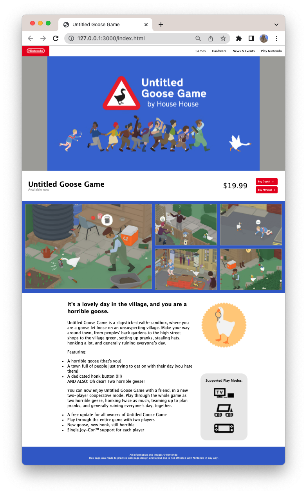
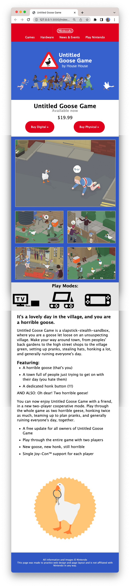

# Untitled Goose Game – Layout Practice

This activity will help you refresh and strengthen layout skills we’ve covered in previous weeks. It also gives you a chance to try a new technique that may come in handy in the future.

We’ll start together with a **follow-along desktop layout**, then you’ll complete a **responsive mobile version** on your own using a separate CSS file.

---

## 🛠️ Getting Started

1. Visit the starter repository page on GitHub: https://github.com/prof-anderson-uc/goose-game

2. Click the green **"Use this template"** button in the top right

3. Select **"Create a new repository"**

4. Name your repository (example: `goose-layout`)

5. Open **GitHub Desktop**, clone your new repo

6. Open the folder in **Visual Studio Code**

---

## 🖥️ Part 1: Desktop Layout (Follow-Along)

Watch the video and follow along to create the desktop version of the site.

- You’ll use `index.html` and `main.css`

- Layout is based on a CSS Grid structure shown in the PDF

- Use semantic HTML5 elements (`<header>`, `<main>`, `<section>`, etc.)

📄 Need help with the layout? [View the Goose Game Layout PDF](images/goose-game-layout.pdf)


---

## 📱 Part 2: Mobile Layout (Your Turn!)

In this part, you’ll create a responsive version of the layout **on your own**.

Instead of adding styles to `main.css`, you’ll write all mobile styles in a **separate file**: `mobile.css`.

This approach mimics a technique sometimes used in real-world CMS theming and legacy projects.

### 🔁 How to connect mobile.css

In your `index.html`, link the file like this:

```html
<link rel="stylesheet" href="mobile.css" media="(max-width: 768px)">
```

📄 The mobile grid layout is also shown in the [Goose Game Layout PDF](images/goose-game-layout.pdf)

---

## ⚖️ Pros & Cons of this Two-File Method

**Disadvantages:**

- The browser has to download an **additional file**
- You're starting over from scratch in the mobile stylesheet instead of just modifying what's different
- You have to **repeat shared styles** in both files
- Visual changes often need to be updated **in two places**

**Advantages:**

- Each file is **simpler and easier to read** because it only contains one possible layout
- You avoid confusing media query conflicts
- Clear separation of **desktop vs. mobile logic**

---

## 🚀 Publishing Your Live Site with GitHub Pages

Once you've finished your layout:

1. Go to your repository on GitHub.com

2. Click **Settings**

3. Under **Pages**, set the source to `main` branch and select `/ (root)` as the folder

4. Click **Save** and wait for your live site link to appear

5. Copy your GitHub Pages URL

6. Go back to your repository homepage and click the gear icon ✏️ in the **About** section (top-right corner of repo page)

7. Paste your live site URL in the **Website** field and save

---

## 📤 Submitting Your Work

Even though you are publishing your live site, you will **submit the URL of your GitHub repository**, not the live site.

✅ Make sure:

- Your repo includes working HTML and both CSS files

- Your live site is published

- Your live link is added to the repo’s **About section**

- You’ve pushed all your final changes

---

## ✅ Final Layout Examples

### Desktop Layout



### Mobile Layout


